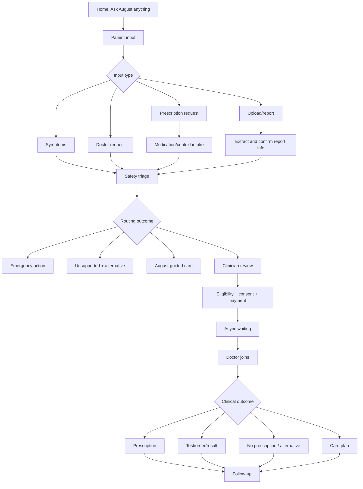
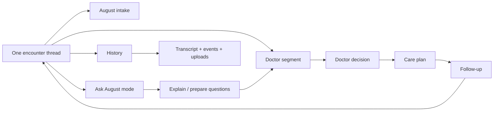

# August AI Product Design Arsenal

## 1. Purpose

This document gives the UX/product-design structure needed to draw the full August experience in Paper and then translate the most important parts into the prototype.

It covers:

- Information architecture.
- Mental model.
- Navigation architecture.
- User journeys.
- User flows.
- State architecture.
- Edge cases.
- Design-system replication.
- Prototype priorities.
- Paper deliverables.

The goal is to have the full arsenal before designing: not just screens, but the logic behind the screens.

## 2. Current August Design System Audit

This is based on August's public website and public app-facing material reviewed on July 25, 2026.

### 2.1 Brand Positioning Seen Publicly

August presents itself as:

- "Hi, I'm August."
- "Secure. Private. Built by doctors."
- "Ask August anything."
- "Tell me your symptoms. Get a clear plan. A licensed doctor reviews and prescribes."
- Free AI symptom guidance.
- Access to clinician review when needed.
- HIPAA/private trust positioning.
- Board-certified doctors across states.
- Lab report, prescription, and health-context analysis.

Design implication:

The prototype should not invent a new brand. It should feel like a premium mobile extension of the existing August promise: simple, private, doctor-backed, and conversational.

### 2.2 Visual Language to Replicate

Observed August direction:

- Lowercase "august" wordmark.
- Deep forest green as signature brand color.
- Warm white or off-white backgrounds.
- Rounded search/chat input surfaces.
- Pills/chips for prompts and trust labels.
- Large calm headline typography.
- Minimal iconography.
- Soft shadows and gentle depth.
- Health-data and chat screenshots framed inside phones.
- Clear "doctor" and "prescription" trust language.

Translate into prototype:

- Use forest green for primary patient bubbles and actions.
- Use warm white canvas.
- Use mint/sage for AI-support surfaces.
- Use plain, spacious August text instead of boxy AI bubbles.
- Use rounded islands for top header, composer, bottom nav, and structured cards.
- Keep the lowercase August wordmark.
- Use trust language sparingly inside the product, not as marketing copy.

### 2.3 Design Tokens

Color roles:

- `Brand forest`: primary actions, patient bubbles, August nav active state.
- `August green`: active indicators, links, status accents.
- `Mint`: AI supportive areas, selected states, status backgrounds.
- `Sage`: secondary labels, history, calm metadata.
- `Warm white`: app canvas.
- `White`: structured cards and clinician surfaces.
- `Urgent deep green`: emergency overlay background.
- `Safety warm accent`: only for urgent/declined/legal moments if needed.

Typography:

- Use Poppins.
- Avoid tiny medical/legal copy in final design.
- Use strong but calm page titles.
- Use readable chat body.
- Use concise labels.

Shape:

- Rounded phone surfaces.
- Pill-shaped prompts.
- Soft rectangular care cards.
- Circular icon buttons.
- Bottom nav with rounded glass container.

Depth:

- Soft green shadows.
- Thin green-tinted borders.
- Subtle glass only for navigation/header/composer.
- Do not apply glass to every object.

### 2.4 Product-Specific Components

Must exist as reusable components:

- App shell.
- Bottom nav.
- August tab.
- Home prompt composer.
- Chat composer.
- Attach menu.
- Patient bubble.
- August plain text message.
- Doctor message.
- Doctor profile capsule.
- System event marker.
- Safety check line.
- Progress/status tracker.
- Care summary card.
- SOAP preview card.
- Upload preview.
- Report extraction summary.
- Consent card.
- Location/state card.
- Payment card.
- Waiting status.
- Prescription card.
- Test order card.
- Care plan card.
- Follow-up prompt.
- Emergency action screen.
- Unsupported care screen.
- Error/retry state.

## 3. Information Architecture

### 3.1 Top-Level App Architecture

The August app should have four primary areas:

1. Home.
2. Visits.
3. Updates.
4. August.

The bottom nav is persistent:

- Home: start and resume care.
- Visits: encounter history and care plans.
- Updates: follow-ups, results, prescriptions, doctor replies.
- August: instant access to AI chat/help.

### 3.2 Home IA

Home contains:

- Greeting.
- Ask August anything composer.
- Active care cards.
- Follow-up due.
- Upload result.
- Medication question.
- Recent encounter.
- Trust microcopy only where useful.

Home should answer:

- What can I do now?
- Is anything waiting for me?
- Can I quickly ask August?
- Can I continue a doctor visit?

### 3.3 Encounter IA

An encounter contains:

- Header.
- Status.
- Thread timeline.
- Active mode.
- Composer.
- Attached documents.
- Summary.
- SOAP packet.
- Doctor messages.
- Orders.
- Prescriptions.
- Care plan.
- Follow-up.
- Audit/history.

Encounter modes:

- August intake.
- Preparing clinician visit.
- Matching clinician.
- Clinician reviewing.
- Doctor chat.
- Ask August.
- History.
- Care plan.
- Follow-up.

### 3.4 Data Object Architecture

Key objects:

- Patient.
- Caregiver.
- Encounter.
- Concern.
- Message.
- Author.
- Safety assessment.
- Clinical fact.
- SOAP note.
- Upload.
- Consent.
- Payment.
- Clinician.
- Doctor review.
- Prescription.
- Pharmacy.
- Test order.
- Test result.
- Care plan.
- Follow-up.
- Notification.
- Audit event.

These objects should appear visually in Paper as cards, timelines, labels, and state changes.

## 4. Mental Model

The intended user mental model:

> August is always available. It helps me explain what is happening, checks safety, prepares information, brings in a doctor when needed, and helps me understand what happens afterward.

The user should not think:

- I am trapped in a bot flow.
- I paid for a prescription.
- The AI is pretending to be my doctor.
- The doctor ignored me.
- My report disappeared after upload.
- I have to restart if I come back later.

## 5. Journey Map

### 5.1 Full Journey

1. Open app.
2. Ask August anything.
3. Describe issue.
4. Safety triage.
5. Adaptive intake.
6. Summary creation.
7. Routing decision.
8. If clinician needed: eligibility, consent, payment.
9. Async waiting.
10. Doctor joins.
11. Doctor asks/decides.
12. Prescription/test/decline/care plan.
13. August explains.
14. Follow-up/check-back.
15. Close or reopen encounter.

### 5.2 Patient Emotional Journey

Start:

- Confused.
- Slightly worried.
- Wants clarity quickly.

During August intake:

- Wants to feel heard.
- Does not want a form.
- Needs concise questions.

Before paying:

- Wants to know why doctor review is needed.
- Wants to know what payment covers.
- Does not want hidden prescription/test costs.

While waiting:

- Needs reassurance that something is happening.
- Needs permission to leave.
- Needs clear worsening instructions.

With doctor:

- Needs confidence this is a real clinician.
- Needs to know doctor saw prior answers.
- Needs response expectations.

After plan:

- Needs plain next steps.
- Needs reminders/follow-up.
- Needs path if worse.

## 6. Core User Flows

### 6.1 Symptom to Clinician

Home -> Ask August -> Patient symptom -> Safety question -> Detail question -> Context question -> Summary -> Clinician recommended -> Eligibility -> Consent -> Payment -> Waiting -> Doctor reviewing -> Doctor question -> Patient response -> Care decision -> Plan -> Follow-up.

### 6.2 Symptom to August-Handled Care

Home -> Ask August -> Symptom -> Safety clear -> Three questions -> Low-risk classification -> August self-care plan -> Escalation signs -> Check-back -> Improved -> Complete.

### 6.3 Prescription Request

Home -> Ask August -> "I need prescription" -> Medication/context intake -> Safety/allergies/current meds -> Supported? -> If yes, clinician review -> Payment -> Doctor decision -> Prescription approved or declined -> Care plan -> Follow-up.

### 6.4 Prescription Declined

Prescription request -> Clinician reviews -> Doctor explains why medication is not recommended -> Alternative care -> Escalation signs -> Follow-up.

### 6.5 Upload Report First

Home -> Upload result -> Patient sends image/PDF -> Upload preview -> Reading report -> Extracted summary -> Patient confirms -> August updates record -> If significant, clinician review -> Care plan/result explanation.

### 6.6 Doctor Request

Home -> "I need a doctor" -> August asks what is happening -> Safety check -> Minimum clinical context -> Eligibility -> Consent/payment -> Waiting -> Doctor joins.

### 6.7 Async Wait and Return

Case submitted -> Matching -> Doctor assigned -> Patient leaves -> Notification -> Patient returns -> Doctor question -> Patient answers -> Doctor reviews answer -> Decision ready.

### 6.8 Worsening After Care

Care plan -> Follow-up -> Patient says worse -> Safety check -> Emergency, clinician review, or revised plan.

### 6.9 Caregiver

User asks about family member -> Clarify who care is for -> Relationship/authorization -> Separate profile/encounter -> Intake -> Routing.

## 7. Flow Diagrams

### 7.1 High-Level Routing

### 7.2 Doctor and August Coexistence

## 8. State Architecture

### 8.1 Conversation States

- Empty.
- Patient composing.
- Message sending.
- Message sent.
- August reviewing.
- August asking.
- Patient answer needed.
- Summary updating.
- Clinician recommended.
- Consent needed.
- Payment needed.
- Submitted.
- Waiting.
- Doctor reviewing.
- Doctor question.
- Waiting for patient.
- Decision ready.
- Encounter closed.
- Follow-up due.

### 8.2 Upload States

- Attach menu open.
- File selected.
- Uploading.
- Uploaded.
- Reading.
- Extraction success.
- Needs confirmation.
- Extraction uncertain.
- Upload failed.
- Unsupported file.
- Needs clinician review.

### 8.3 Prescription States

- Requested.
- Context needed.
- Clinician review needed.
- Approved.
- Declined.
- Sent to pharmacy.
- Pharmacy confirmed.
- Ready for pickup.
- Fulfillment issue.
- Changed by clinician.
- Cancelled.

### 8.4 Test States

- Recommended.
- Ordered.
- Scheduled.
- Kit shipped.
- Sample collected.
- Processing.
- Result available.
- August summary available.
- Clinician review required.
- Clinician reviewed.
- Follow-up plan ready.

### 8.5 Waiting States

- Preparing case.
- Checking eligibility.
- Matching clinician.
- Clinician assigned.
- Reviewing.
- Extended wait.
- Doctor asked question.
- Waiting for patient.
- Reviewing answer.
- Plan ready.

## 9. Edge Case Arsenal

### 9.1 Clinical/Safety Edge Cases

- Patient reports red flag mid-intake.
- Patient reports red flag while waiting.
- Patient reports worsening after care plan.
- Patient mentions self-harm.
- Patient cannot answer safety question clearly.
- Patient gives contradictory answers.
- Patient says "yes" to danger signs but later says "I meant no."
- Patient asks for emergency advice but refuses emergency care.
- Child/pregnancy/immunocompromised context appears late.
- Uploaded result conflicts with patient symptoms.

### 9.2 Prescription Edge Cases

- Controlled medication request.
- Antibiotic requested without sufficient criteria.
- Patient expects guaranteed prescription.
- Patient has allergy to likely medication.
- Patient is already taking interacting medication.
- Patient wants refill but cannot provide dose.
- Prescription approved but pharmacy unavailable.
- Pharmacy rejects prescription.
- Clinician changes medication after result.
- Patient asks August to override doctor.

### 9.3 Doctor/Async Edge Cases

- No clinician available.
- Doctor response delayed beyond expectation.
- Doctor asks question while patient is offline.
- Patient returns after long time.
- Patient answers after encounter window expires.
- Doctor closes encounter.
- Patient sends new unrelated concern inside active encounter.
- Patient wants different doctor.
- Doctor recommends in-person care.

### 9.4 Upload/Report Edge Cases

- Blurry image.
- Wrong file type.
- Multiple reports uploaded.
- Report belongs to another person.
- Report date is old.
- Result is abnormal.
- Result is normal but symptoms concerning.
- OCR confidence low.
- Patient disagrees with extraction.
- Upload contains sensitive nonmedical info.

### 9.5 Payment/Eligibility Edge Cases

- Service unavailable in state.
- Patient under age.
- Location mismatch.
- Identity verification fails.
- Consent not accepted.
- Payment fails.
- Patient wants refund after no prescription.
- Price changes because test/pharmacy cost is separate.
- Patient thinks payment guarantees medication.

### 9.6 Conversation Edge Cases

- Patient sends long paragraph.
- Patient sends one-word answer.
- Patient changes topic.
- Patient repeats same question.
- Patient asks "Are you a doctor?"
- Patient asks for diagnosis certainty.
- Patient uses non-English text.
- Patient asks about family member.
- Patient becomes frustrated.
- Patient wants to talk to a person immediately.

## 10. Paper Deliverable Architecture

Paper should be organized as:

1. Cover / problem statement.
2. Research and product principles.
3. Current August design-system audit.
4. Information architecture.
5. Journey map.
6. Flow diagrams.
7. Component library.
8. Core mobile screens.
9. Prototype flows.
10. Edge cases and states.
11. Compliance-sensitive annotations.
12. Final recommendation.

## 11. Component Library to Draw in Paper

Foundations:

- Color palette.
- Typography.
- Spacing.
- Elevation/glass.
- Icon style.

Navigation:

- Bottom nav.
- August active tab.
- Care header.
- Mode switch.

Messaging:

- Patient bubble.
- August plain text.
- Doctor message.
- System event.
- Composer.
- Attachment preview.

Clinical objects:

- Care summary.
- SOAP preview.
- Safety alert.
- Emergency action.
- Unsupported-care card.
- Doctor profile.
- Prescription.
- Pharmacy.
- Test order.
- Report result.
- Care plan.
- Follow-up.

Operational:

- Waiting tracker.
- Consent.
- Payment.
- Identity.
- Location/state.
- Error/retry.
- Notification.

## 12. Prototype Prioritization

The code prototype should not attempt all 90+ states. It should show the core concept convincingly.

Priority 1:

- Home.
- Three-question August intake.
- Recommendation.
- Summary.
- Payment/consent.
- Waiting.
- Doctor joins.
- Ask August mode.
- Care plan.
- Follow-up.

Priority 2:

- Upload/report summary.
- Prescription approved/declined.
- Test order/result.
- Unsupported care.
- Emergency.

Priority 3:

- Caregiver.
- More error states.
- Pharmacy issue.
- Extended wait.
- Session resume.

## 13. August-Specific Design System Rules

### 13.1 Keep

- Lowercase August.
- Deep green.
- Warm white.
- Rounded pills/search fields.
- "Ask anything" mental model.
- Doctor-backed trust.
- AI guidance first, clinician care when needed.
- Privacy/HIPAA trust cues.
- Report/prescription upload capability.

### 13.2 Adapt

Marketing claims should become product-state copy.

Marketing:

> Secure. Private. Built by doctors.

In-product:

> Private by design. August prepares care; clinicians make clinical decisions.

Marketing:

> See a doctor when needed.

In-product:

> August prepares the context. A clinician makes clinical decisions.

Marketing:

> Ask anything.

In-product:

> Ask August anything.

### 13.3 Avoid

- Overusing website hero language inside clinical chat.
- Making doctor visits feel instantly guaranteed.
- Making prescription language sound guaranteed.
- Turning every AI message into a green bubble.
- Losing the premium white/green simplicity.

## 14. Design Review Checklist

Before calling the design strong, check:

- Does the first screen feel like August?
- Is August always on the bottom right?
- Is the chat composer persistent?
- Are August responses plain text?
- Does August ask three questions before recommending?
- Is doctor entry obvious?
- Does doctor have photo/credentials?
- Does async waiting feel alive?
- Does report upload feel native?
- Does follow-up continue the same story?
- Are AI and clinician boundaries visible?
- Is there no apology-liability language?
- Are emergency paths obvious?
- Are unsupported paths useful?
- Are pricing and prescriptions separated?
- Are edge cases represented?
- Does Paper have enough architecture, not just screens?

## 15. Source Notes

Research and public product references:

- August public site: https://www.meetaugust.ai/
- August prescription reader: https://www.meetaugust.ai/prescription-reader
- August health memory import: https://www.meetaugust.ai/tool/import-memory
- August telehealth article: https://www.meetaugust.ai/en/articles/telehealth-app
- AMA augmented intelligence: https://www.ama-assn.org/practice-management/digital-health/augmented-intelligence-medicine
- WHO AI health ethics: https://www.who.int/publications/i/item/9789240029200
- HHS telehealth consent: https://telehealth.hhs.gov/providers/preparing-patients-for-telehealth/obtaining-informed-consent
- HHS health app developer resources: https://www.hhs.gov/hipaa/for-professionals/special-topics/health-apps/index.html
- FDA ML-enabled medical-device transparency principles: https://www.fda.gov/medical-devices/software-medical-device-samd/transparency-machine-learning-enabled-medical-devices-guiding-principles
- NN/g chatbot qualities: https://www.nngroup.com/articles/dimensions-of-ai-chatbots/
- NN/g chatbot UX: https://www.nngroup.com/articles/chatbots/
